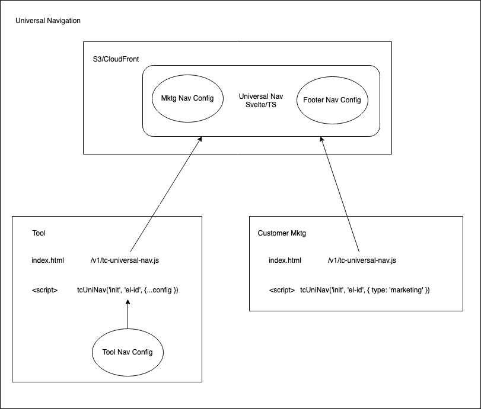

# UniNav Development Information

This README provides instructions on how to develop the UniNav itself.

For information re how to integrate the UniNav into a web property, see the main [README](../README.md).

- [Architecture Diagram](#architecture-diagram)
- [Why Svelte?](#why-svelte)
- [Infrastructure](#infrastructure)
- [Local App Development](#local-app-development)
    - [Serve the local app](#serve-the-local-app)
    - [Demo Apps](#demo-apps)
        - [Instructions for using the Demo Apps](#instructions-for-using-the-demo-apps)
- [Production Distribution](#production-distribution)
- [Recommended IDE Setup](#recommended-ide-setup)
- [Typescript Type Declaration Generation](#typescript-type-declaration-generation)

## Architecture Diagram

## Why Svelte?

The primary architectural concerns for the Uni Nav are:

- universal integration (i.e. server-side or client-side rendered app)
- independent integration (i.e. no other libraries or packages required)
- extreme performance (i.e. fast and small)

The good news is that the Uni Nav does not have to do much.

When deciding on what to use for writing the universal navigation, there were 4 possibilities that were took into consideration:
- angular
- react
- svelte
- vanilla

React & Angular are too bloated and they're overkill for the job.

We have to handle a lot of repeating items and also we need to make sure the css doesn't bleed out, so Vanilla was rulled out quickly because it meant to write too much "extra" code.

Svelte doesn't need an additional runtime library, it compiles all the code at the build time and outputs only the code that is actually used, without adding any overhead code to run in the browser. Which translates into smaller files which means faster download & interpretation times.

See https://refine.dev/blog/svelte-vs-react/, https://pagepro.co/blog/react-vs-svelte/ for more info

## Infrastructure

The UniNav JS is stored in S3 with a CloudFront CDN, and the JS files are cached and compressed.

See [IAC README](../iac/README.md) for more details.

## Local App Development

See [Environment Files](../README.md#environment-files) for defining your .env file locally or for production building.

### Serve the local app

[`../index.html`](../index.html) instantiates all 3 types of navigation (marketing, tool, footer) and will pass the user data to them after 3 seconds.

Run `% npm run dev` to view the app at http://localhost:5173/.

### Demo Apps

The `demo` files are just basic (bare minimum) example of how to integrate the navigation in a simple html file.

There are 2 sample integrations in the [/demo](./demo/) folder:

[Marketing Navigation](../demo/marketing/index.html)

[Tool Navigation](../demo/tool/index.html)

#### Instructions for using the Demo Apps

1. Build the navigation files
    - `% npm run build`

2. Serve the demo app
    - `% npm run demo`
    - http://localhost:8083

3. Navigate to the specific nav:
    - Marketing Nav: http://localhost:8081
    - Tool Nav: http://localhost:8082

## Production Distribution

Run `npm run build` to build the files for production. The output is to be found in the `dist` folder.

The build reads the app version in `package.json` and automatically outputs the files in the correct directory.

## Recommended IDE Setup

[VS Code](https://code.visualstudio.com/) + [Svelte](https://marketplace.visualstudio.com/items?itemName=svelte.svelte-vscode).

## Typescript Type Declaration Generation

Typescript type declarations (i.e. `*.d.ts`) are automatically generated upon build. When developing the nav, it is preferred that each branch regenerates its types before PR merge.

However, this is obviously error prone, so every time a push is made to master, the CI process will  regenerate the types and commit them to the master branch if there are differences.

In addition, all pushes to the master branch will automatically increment the patch version number, which will allow the consumers of the types to get the updates with `npm update` or `yarn upgrade`.

Both the types commit and the version patch commit will be authored by the user who merged the PR.

For non-master branches, there is a build job in the CI that will check to see if there are any updates to the types required and exit with an error code 1 with message `WARNING: Types need updating`.

The error will not prevent merging a PR or deploying to an environment but will just be a flag for the PR owner and reviewers.
